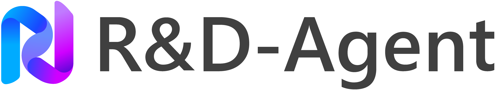
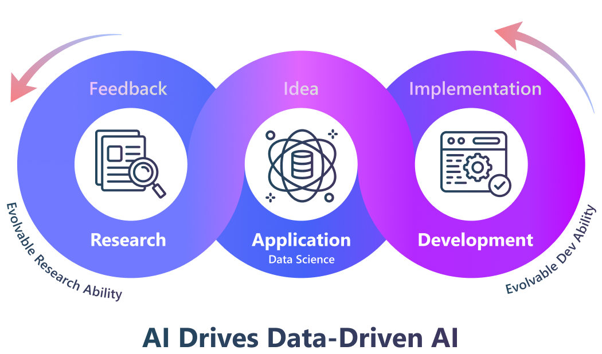
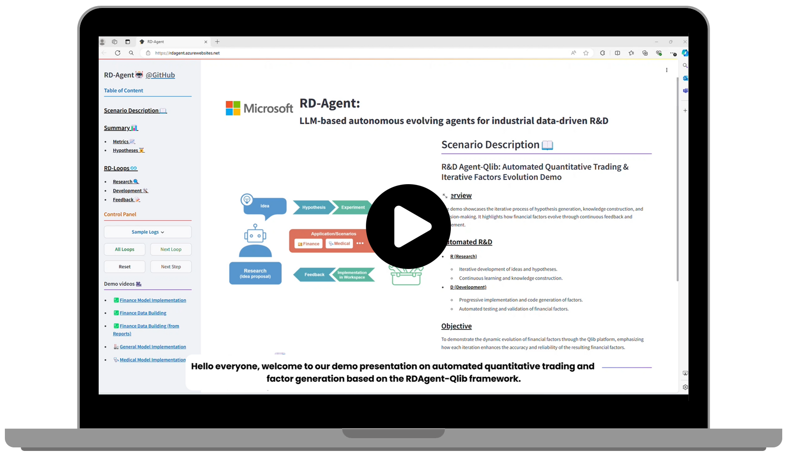

<h4 align="center">
  
  
  <a href="https://rdagent.azurewebsites.net" target="_blank">🖥️ 在线演示</a> |
  <a href="https://rdagent.azurewebsites.net/factor_loop" target="_blank">🎥 演示视频</a> <a href="https://www.youtube.com/watch?v=JJ4JYO3HscM&list=PLALmKB0_N3_i52fhUmPQiL4jsO354uopR" target="_blank">▶️YouTube</a>   |
  <a href="https://rdagent.readthedocs.io/en/latest/index.html" target="_blank">📖 文档</a> |
  <a href="https://aka.ms/RD-Agent-Tech-Report" target="_blank">📄 技术报告</a> |
  <a href="#-paperwork-list"> 📃 论文 </a>
</h3>

[](https://github.com/microsoft/RD-Agent/actions/workflows/ci.yml)
[](https://github.com/microsoft/RD-Agent/actions/workflows/github-code-scanning/codeql)
[](https://github.com/microsoft/RD-Agent/actions/workflows/dependabot/dependabot-updates)
[](https://github.com/microsoft/RD-Agent/actions/workflows/pr.yml)
[](https://github.com/microsoft/RD-Agent/actions/workflows/release.yml)
[](https://pypi.org/project/rdagent/#files)
[](https://pypi.org/project/rdagent/)
[](https://pypi.org/project/rdagent/)
[](https://github.com/microsoft/RD-Agent/releases)
[](https://github.com/microsoft/RD-Agent/blob/main/LICENSE)
[](https://github.com/pre-commit/pre-commit)
[](http://mypy-lang.org/)
[](https://github.com/astral-sh/ruff)
[](https://discord.gg/ybQ97B6Jjy)
[](https://rdagent.readthedocs.io/en/latest/?badge=latest)
[](https://github.com/microsoft/RD-Agent/actions/workflows/readthedocs-preview.yml) <!-- this badge is too long, please place it in the last one to make it pretty --> 
[](https://arxiv.org/abs/2505.14738)

# 🏆 最佳机器学习工程智能体！

[MLE-bench](https://github.com/openai/mle-bench) 是一个全面评测 AI 智能体在机器学习工程任务表现的基准，涵盖 75 个 Kaggle 竞赛数据集，能真实反映 AI 系统在实际 ML 工程场景下的能力。

R&D-Agent 目前在 MLE-bench 上是表现最优的机器学习工程智能体：

| 智能体                        | 低==Lite (%)  | 中等 (%)      | 高 (%)        | 总体 (%)       |
|----------------------------|--------------|-------------|--------------|--------------|
| R&D-Agent o1-preview       | 48.18 ± 2.49 | 8.95 ± 2.36 | 18.67 ± 2.98 | 22.4 ± 1.1   |
| R&D-Agent o3(R)+GPT-4.1(D) | 51.52 ± 6.21 | 7.89 ± 3.33 | 16.67 ± 3.65 | 22.45 ± 2.45 |
| AIDE o1-preview            | 34.3 ± 2.4   | 8.8 ± 1.1   | 10.0 ± 1.9   | 16.9 ± 1.1   |

**说明：**
- **O3(R)+GPT-4.1(D)**：该版本旨在降低平均循环时间，并通过无缝集成 Research Agent (o3) 与 Development Agent (GPT-4.1) 实现高性价比。
- **AIDE o1-preview**：为 MLE-bench 论文中报告的先前最佳公开结果。
- R&D-Agent o1-preview 的均值和标准差基于 5 个种子，R&D-Agent o3(R)+GPT-4.1(D) 基于 6 个种子。
- MLE-Bench 将 75 个竞赛分为三类：**Low==Lite**（经验丰富工程师2小时内可完成）、**Medium**（2-10小时）、**High**（10小时以上）。

详细运行结果可在线查看：
- [R&D-Agent o1-preview 详细运行](https://aka.ms/RD-Agent_MLE-Bench_O1-preview)
- [R&D-Agent o3(R)+GPT-4.1(D) 详细运行](https://aka.ms/RD-Agent_MLE-Bench_O3_GPT41)

如何在 MLE-bench 上运行 R&D-Agent，请参考 **[MLE-bench 指南](https://rdagent.readthedocs.io/en/latest/scens/data_science.html)**

# 🥇 首个数据驱动量化多智能体框架！

R&D-Agent for Quantitative Finance，简称 **RD-Agent(Q)**，是首个数据驱动、面向量化策略全流程自动化的多智能体框架，实现因子-模型协同优化。


真实股市实验表明，RD-Agent(Q) 在成本低于 $10 的情况下，ARR 约为基准因子库的 2 倍，且所用因子数减少 70% 以上。在资源受限时也优于 SOTA 深度时序模型。交替优化因子与模型，兼顾预测精度与策略稳健性。

详细介绍可参考 [论文](https://arxiv.org/abs/2505.15155) 和 [文档](https://rdagent.readthedocs.io/en/latest/scens/quant_agent_fin.html)。

# 📰 新闻
| 🗞️ 新闻        | 📝 描述                 |
| --            | ------      |
| [技术报告发布](#overall-technical-report) | 框架与 MLE-bench 结果 | 
| [R&D-Agent-Quant 发布](#deep-application-in-diverse-scenarios) | 应用于量化交易 | 
| MLE-Bench 结果发布 | R&D-Agent 目前为 [最佳 ML 工程智能体](#-the-best-machine-learning-engineering-agent) |
| 支持 LiteLLM 后端 | 现已全面支持 **[LiteLLM](https://github.com/BerriAI/litellm)** 多 LLM 集成 |
| 通用数据科学智能体 | [数据科学智能体](https://rdagent.readthedocs.io/en/latest/scens/data_science.html) |
| Kaggle 场景发布 | 发布 **[Kaggle Agent](https://rdagent.readthedocs.io/en/latest/scens/data_science.html)**，欢迎体验新功能！ |
| 微信交流群发布  | 欢迎加入微信群！(🗪[二维码](https://github.com/microsoft/RD-Agent/issues/880)) |
| Discord 社区发布  | 加入 Discord 聊天频道 (🗪[](https://discord.gg/ybQ97B6Jjy)) |
| 首次开源 | **R&D-Agent** 正式开源 |

# 数据科学智能体预览

演示视频展示了数据科学智能体的开发进展：

https://github.com/user-attachments/assets/3eccbecb-34a4-4c81-bce4-d3f8862f7305

# 🌟 项目简介
<div align="center">
      
</div>

R&D-Agent 致力于自动化工业研发中最关键、最有价值的环节，首先聚焦数据驱动场景，提升模型与数据开发效率。
方法论上，我们提出了“R”提出新想法、“D”实现想法的框架。
我们相信，研发自动进化将带来极具产业价值的解决方案。

<!-- Tag Cloud -->
R&D 是非常通用的场景。R&D-Agent 可成为你的：
- 💰 **自动量化工厂** ([🎥演示视频](https://rdagent.azurewebsites.net/factor_loop)|[▶️YouTube](https://www.youtube.com/watch?v=X4DK2QZKaKY&t=6s))
- 🤖 **数据挖掘智能体**：迭代提出数据与模型 ([🎥演示1](https://rdagent.azurewebsites.net/model_loop)|[▶️YouTube](https://www.youtube.com/watch?v=dm0dWL49Bc0&t=104s)) ([🎥演示2](https://rdagent.azurewebsites.net/dmm)|[▶️YouTube](https://www.youtube.com/watch?v=VIaSTZuoZg4))，并通过数据学习实现。
- 🦾 **研究 Copilot**：自动阅读论文 ([🎥演示](https://rdagent.azurewebsites.net/report_model)|[▶️YouTube](https://www.youtube.com/watch?v=BiA2SfdKQ7o)) / 财报 ([🎥演示](https://rdagent.azurewebsites.net/report_factor)|[▶️YouTube](https://www.youtube.com/watch?v=ECLTXVcSx-c))，实现模型结构或数据集。
- 🤖 **Kaggle 智能体**：自动模型调优与特征工程([🎥演示即将上线...]())，助力竞赛。
- ...

点击上方链接可查看演示。我们持续丰富方法与场景，助力你的研发流程与生产力提升。

更多案例可见 **[🖥️ 在线演示](https://rdagent.azurewebsites.net/)**。

<div align="center">
    <a href="https://rdagent.azurewebsites.net/" target="_blank">
        
    </a>
</div>

# ⚡ 快速上手

你可以通过以下命令体验上述演示：

### 🐳 安装 Docker
大多数场景需先安装 Docker。请参考 [官方 🐳Docker 页面](https://docs.docker.com/engine/install/) 获取安装说明。
确保当前用户可**无需 sudo**运行 Docker。可通过 `docker run hello-world` 验证。

### 🐍 创建 Conda 环境
- 新建 conda 环境（推荐 Python 3.10/3.11）：
  ```sh
  conda create -n rdagent python=3.10
  ```
- 激活环境：
  ```sh
  conda activate rdagent
  ```

### 🛠️ 安装 R&D-Agent
- 通过 PyPI 安装 R&D-Agent 包：
  ```sh
  pip install rdagent
  ```

### 💊 健康检查
- rdagent 提供健康检查功能，当前检查两项：
  - docker 是否安装成功
  - [rdagent ui](https://github.com/microsoft/RD-Agent?tab=readme-ov-file#%EF%B8%8F-monitor-the-application-results) 默认端口是否被占用
  ```sh
  rdagent health_check
  ```

### ⚙️ 配置
- 演示需具备如下能力：
  - ChatCompletion
  - json_mode
  - embedding query

  你可以通过如下方式设置 Chat Model 与 Embedding Model：

- **使用 LiteLLM（默认）**：现已支持 LiteLLM 多 LLM 集成。配置方式如下：

  **选项 1：统一 API base**
  ```bash
  cat << EOF  > .env
  # 设置为 LiteLLM 支持的任意模型。
  CHAT_MODEL=gpt-4o 
  EMBEDDING_MODEL=text-embedding-3-small
  # 配置统一 API base
  OPENAI_API_BASE=<你的统一 api base>
  OPENAI_API_KEY=<替换为你的 openai api key>
  ```

  **选项 2：分别配置聊天与嵌入模型的 API base**
  ```bash
  cat << EOF  > .env
  # 设置为 LiteLLM 支持的任意模型。
  # 聊天模型：
  CHAT_MODEL=gpt-4o 
  OPENAI_API_BASE=<你的聊天 api base>
  OPENAI_API_KEY=<替换为你的 openai api key>

  # 嵌入模型：
  # 以 siliconflow 为例，也可用其他提供商。
  # 注意：嵌入模型需加 litellm_proxy 前缀
  EMBEDDING_MODEL=litellm_proxy/BAAI/bge-large-en-v1.5
  LITELLM_PROXY_API_KEY=<替换为你的 siliconflow api key>
  LITELLM_PROXY_API_BASE=https://api.siliconflow.cn/v1
  ```

  注意：如使用带思考过程的推理模型（如含 <think> 标签），需设置如下环境变量：
  ```bash
  REASONING_THINK_RM=True
  ```

- 仅用 OpenAI API 或 Azure OpenAI 时可用旧版后端。更多配置请见 [文档](https://rdagent.readthedocs.io/en/latest/installation_and_configuration.html)。

### 🚀 运行应用

**[🖥️ 在线演示](https://rdagent.azurewebsites.net/)** 由以下命令实现（每项为一个演示，可任选）：

- 运行**自动量化交易与因子-模型协同进化**：
  ```sh
  rdagent fin_quant
  ```

- 运行**自动量化交易与因子进化**：
  ```sh
  rdagent fin_factor
  ```

- 运行**自动量化交易与模型进化**：
  ```sh
  rdagent fin_model
  ```

- 运行**自动量化交易与财报因子提取**：
  ```sh
  # 1. 通用命令：
  rdagent fin_factor_report --report_folder=<你的财报文件夹路径>

  # 2. 具体示例：
  wget https://github.com/SunsetWolf/rdagent_resource/releases/download/reports/all_reports.zip
  unzip all_reports.zip -d git_ignore_folder/reports
  rdagent fin_factor_report --report_folder=git_ignore_folder/reports
  ```

- 运行**自动模型研发 Copilot**：
  ```sh
  # 1. 通用命令：
  rdagent general_model <你的论文URL>

  # 2. 具体示例：
  rdagent general_model  "https://arxiv.org/pdf/2210.09789"
  ```

- 运行**自动 Kaggle 模型调优与特征工程**：
  > 以 **sf-crime** *(旧金山犯罪分类)* 为例。<br />
  > 1. 注册并登录 [Kaggle](https://www.kaggle.com/)。<br />
  > 2. 配置 Kaggle API。<br />
  > (1) 头像->`Settings`->`Create New Token`，下载 `kaggle.json`。<br />
  > (2) 移动到 `~/.config/kaggle/`<br />
  > (3) 修改权限：`chmod 600 ~/.config/kaggle/kaggle.json`<br />
  > 3. 加入竞赛：点击 `Join the competition` -> `I Understand and Accept`。<br />
  ```bash
  # 通用命令：
  rdagent data_science --competition <竞赛名>

  # 具体示例：
  mkdir -p ./git_ignore_folder/kaggle_data
  dotenv set DS_LOCAL_DATA_PATH "$(pwd)/git_ignore_folder/kaggle_data"
  dotenv set DS_IF_USING_MLE_DATA True
  rdagent data_science --competition sf-crime
  ```

### 🖥️ 监控应用结果
- 可用如下命令查看运行日志：

  ```sh
  rdagent ui --port 19899 --log_dir <你的日志文件夹，如 "log/"> 
  ```

  **注意：** 运行前请确保 19899 端口未被占用，否则请更换端口。

  检查端口占用：
  ```sh
  rdagent health_check
  ```

# 🏭 场景

R&D-Agent 已应用于多个有价值的数据驱动工业场景。

## 🎯 目标：数据驱动研发智能体

本项目旨在构建自动化数据驱动研发智能体，具备：
+ 📄 读取真实材料（报告、论文等），**提取**关键公式、特征与模型描述。
+ 🛠️ **实现**提取的公式（如特征、因子、模型）为可运行代码。
   + 由于 LLM 一次性实现能力有限，智能体通过进化过程不断提升。
+ 💡 基于当前知识与观察，**提出新想法**。

## 📈 场景/演示

在数据驱动场景的模型实现与数据构建两大核心领域，系统服务于两类主要角色：🦾Copilot 与 🤖Agent。
- 🦾Copilot 按人类指令自动化重复任务。
- 🤖Agent 更具自主性，主动提出新想法。

支持场景如下：

| 场景/目标     | 模型实现                                                                                                                                           | 数据构建                                                                                                                                                                                                                                                        |
|-----------|------------------------------------------------------------------------------------------------------------------------------------------------|-------------------------------------------------------------------------------------------------------------------------------------------------------------------------------------------------------------------------------------------------------------|
| **💹 金融** | 🤖 [迭代提出想法与进化](https://rdagent.azurewebsites.net/model_loop)[▶️YouTube](https://www.youtube.com/watch?v=dm0dWL49Bc0&t=104s)                    | 🤖 [迭代提出想法与进化](https://rdagent.azurewebsites.net/factor_loop) [▶️YouTube](https://www.youtube.com/watch?v=X4DK2QZKaKY&t=6s) <br/>   🦾 [自动报告阅读与实现](https://rdagent.azurewebsites.net/report_factor)[▶️YouTube](https://www.youtube.com/watch?v=ECLTXVcSx-c) |
| **🩺 医疗** | 🤖 [迭代提出想法与进化](https://rdagent.azurewebsites.net/dmm)[▶️YouTube](https://www.youtube.com/watch?v=VIaSTZuoZg4)                                  | -                                                                                                                                                                                                                                                           |
| **🏭 通用** | 🦾 [自动论文阅读与实现](https://rdagent.azurewebsites.net/report_model)[▶️YouTube](https://www.youtube.com/watch?v=BiA2SfdKQ7o) <br/> 🤖 自动 Kaggle 模型调优 | 🤖自动 Kaggle 特征工程                                                                                                                                                                                                                                            |

- **[路线图](https://rdagent.readthedocs.io/en/latest/scens/data_science.html#roadmap)**：Kaggle 场景新功能开发中。

不同场景入口与配置各异，详见场景文档。

更多案例见 [成功探索集锦](https://github.com/SunsetWolf/rdagent_resource/releases/download/demo_traces/demo_traces.zip)（5 个案例在 **[🖥️ 在线演示](https://rdagent.azurewebsites.net/)** 展示）。可按[文档说明](https://github.com/microsoft/RD-Agent?tab=readme-ov-file#%EF%B8%8F-monitor-the-application-results)下载并查看执行轨迹。

详见 **[📖readthedocs_scen](https://rdagent.readthedocs.io/en/latest/scens/catalog.html)**。

# ⚙️ 框架

<div align="center">
    
</div>

自动化数据科学研发流程是极具价值但尚未充分探索的领域。我们提出的框架推动该领域发展。

研究问题分三类：
| 研究方向 | 论文/工作列表 |
|--------------------|-----------------|
| **研发能力基准评测** | [基准评测](#benchmark) |
| **想法提出：** 探索新思路或优化现有方案 | [科研](#research) |
| **实现能力：** 实现与执行想法 | [开发](#development) |

我们认为，持续进化研发能力是高质量解决方案的关键。智能体应像专家一样持续成长。

更多文档见 **[📖 readthedocs](https://rdagent.readthedocs.io/)**。

# 📃 论文/工作列表

## 总体技术报告
- [R&D-Agent: Automating Data-Driven AI Solution Building Through LLM-Powered Automated Research, Development, and Evolution](https://arxiv.org/abs/2505.14738)
```BibTeX
@misc{yang2024rdagent,
    title={R\&D-Agent: Automating Data-Driven AI Solution Building Through LLM-Powered Automated Research, Development, and Evolution},
    author={Xu Yang and Xiao Yang and Shikai Fang and Bowen Xian and Yuante Li and Jian Wang and Minrui Xu and Haoran Pan and Xinpeng Hong and Weiqing Liu and Yelong Shen and Weizhu Chen and Jiang Bian},
    year={2025},
    eprint={2505.14738},
    archivePrefix={arXiv},
    primaryClass={cs.AI},
    url={https://arxiv.org/abs/2505.14738}
}
```


## 📊 基准评测
- [Towards Data-Centric Automatic R&D](https://arxiv.org/abs/2404.11276)
```BibTeX
@misc{chen2024datacentric,
    title={Towards Data-Centric Automatic R&D},
    author={Haotian Chen and Xinjie Shen and Zeqi Ye and Wenjun Feng and Haoxue Wang and Xiao Yang and Xu Yang and Weiqing Liu and Jiang Bian},
    year={2024},
    eprint={2404.11276},
    archivePrefix={arXiv},
    primaryClass={cs.AI}
}
```


## 🔍 科研

数据挖掘专家的日常研发流程包括提出假设（如 RNN 能捕捉时序数据模式）、设计实验（如在金融数据中验证假设）、实现代码（如 Pytorch 结构），并通过反馈（如指标、损失曲线）不断优化。

基于上述原则，我们建立了持续提出假设、验证并从实践中获取反馈的基础方法框架。这是首个支持与真实世界联动验证的科研自动化框架。

更多细节见 **[🖥️ 在线演示页面](https://rdagent.azurewebsites.net)**。

## 🛠️ 开发

- [协同进化策略：自动数据驱动开发](https://arxiv.org/abs/2407.18690)
```BibTeX
@misc{yang2024collaborative,
    title={Collaborative Evolving Strategy for Automatic Data-Centric Development},
    author={Xu Yang and Haotian Chen and Wenjun Feng and Haoxue Wang and Zeqi Ye and Xinjie Shen and Xiao Yang and Shizhao Sun and Weiqing Liu and Jiang Bian},
    year={2024},
    eprint={2407.18690},
    archivePrefix={arXiv},
    primaryClass={cs.AI}
}
```


## 多场景深度应用

- [R&D-Agent-Quant: A Multi-Agent Framework for Data-Centric Factors and Model Joint Optimization](https://arxiv.org/abs/2505.15155)
```BibTeX
@misc{li2025rdagentquant,
    title={R\&D-Agent-Quant: A Multi-Agent Framework for Data-Centric Factors and Model Joint Optimization},
    author={Yuante Li and Xu Yang and Xiao Yang and Minrui Xu and Xisen Wang and Weiqing Liu and Jiang Bian},
    year={2025},
    eprint={2505.15155},
    archivePrefix={arXiv},
    primaryClass={cs.AI}
}
```


# 🤝 贡献指南

欢迎为 R&D-Agent 提交贡献和建议。详见 [贡献指南](CONTRIBUTING.md)。

提交 PR 前请确保代码通过自动化 CI 检查。

## 📝 说明
本项目欢迎各类贡献与建议。
无论是修复 bug、完善文档、优化代码还是修正错别字，每一份贡献都很宝贵。

可先浏览 issues 列表，或用 `grep -r "TODO:"` 搜索代码中的 `TODO:`。


<a href="https://github.com/microsoft/RD-Agent/graphs/contributors">
  
</a>

R&D-Agent 开源前为组内项目，因去除部分敏感代码，部分成员（如 Haotian Chen、Wenjun Feng、Haoxue Wang、Zeqi Ye、Xinjie Shen、Jinhui Li）贡献未计入公开提交。

# ⚖️ 法律声明
<p style="line-height: 1; font-style: italic;">RD-agent 按“原样”提供，不附带任何明示或暗示担保，包括但不限于适销性、特定用途适用性和非侵权。RD-agent 旨在促进金融行业研发流程，不适用于任何金融投资或建议。用户应自行评估和测试 RD-agent 在具体场景下的风险，确保负责任地使用 AI 技术（包括但不限于风险缓解措施），并遵守所有适用法律法规。RD-agent 不提供金融意见，也不代表微软立场，亦不替代专业金融人员。RD-agent 的输入输出归用户所有，用户应承担全部责任。</p>
