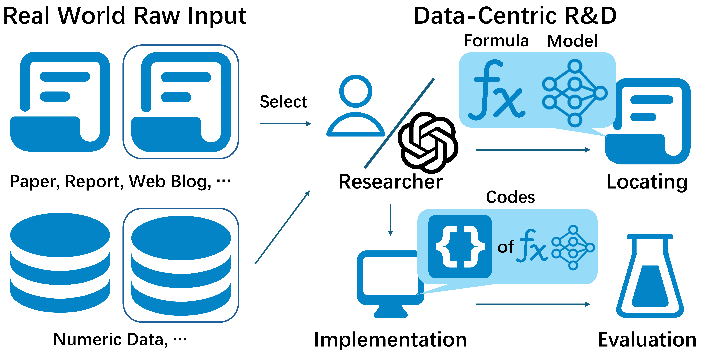

<h4 align="center">
  
  
  <a href="https://rdagent.azurewebsites.net" target="_blank">🖥️ 在线演示</a> |
  <a href="https://rdagent.azurewebsites.net/factor_loop" target="_blank">🎥 演示视频</a> <a href="https://www.youtube.com/watch?v=JJ4JYO3HscM&list=PLALmKB0_N3_i52fhUmPQiL4jsO354uopR" target="_blank">▶️YouTube</a>   |
  <a href="https://rdagent.readthedocs.io/en/latest/index.html" target="_blank">📖 文档</a> |
  <a href="https://aka.ms/RD-Agent-Tech-Report" target="_blank">📄 技术报告</a> |
  <a href="#-paperwork-list"> 📃 论文 </a>
</h3>


[](https://github.com/microsoft/RD-Agent/actions/workflows/ci.yml)
[](https://github.com/microsoft/RD-Agent/actions/workflows/github-code-scanning/codeql)
[](https://github.com/microsoft/RD-Agent/actions/workflows/dependabot/dependabot-updates)
[](https://github.com/microsoft/RD-Agent/actions/workflows/pr.yml)
[](https://github.com/microsoft/RD-Agent/actions/workflows/release.yml)
[](https://pypi.org/project/rdagent/#files)
[](https://pypi.org/project/rdagent/)
[](https://pypi.org/project/rdagent/)
[](https://github.com/microsoft/RD-Agent/releases)
[](https://github.com/microsoft/RD-Agent/blob/main/LICENSE)
[](https://github.com/pre-commit/pre-commit)
[](http://mypy-lang.org/)
[](https://github.com/astral-sh/ruff)
[](https://discord.gg/ybQ97B6Jjy)
[](https://rdagent.readthedocs.io/en/latest/?badge=latest)
[](https://github.com/microsoft/RD-Agent/actions/workflows/readthedocs-preview.yml) <!-- this badge is too long, please place it in the last one to make it pretty --> 
[](https://arxiv.org/abs/2505.14738)


# 🏆 最好的机器学习工程智能体！

[MLE-bench](https://github.com/openai/mle-bench) 是一个综合性基准测试，用于评估人工智能体在机器学习工程任务中的表现。MLE-bench 利用 75 个 Kaggle 竞赛的数据集，对人工智能系统在真实世界机器学习工程场景中的能力进行稳健评估。

R&D-Agent 目前是 MLE-bench 上表现最佳的机器学习工程智能体：

| 智能体 | 低 == Lite (%) | 中 (%) | 高 (%) | 全部 (%) |
|---------|--------|-----------|---------|----------|
| R&D-Agent o1-preview | 48.18 ± 2.49 | 8.95 ± 2.36 | 18.67 ± 2.98 | 22.4 ± 1.1 |
| R&D-Agent o3(R)+GPT-4.1(D) | 51.52 ± 6.21 | 7.89 ± 3.33 | 16.67 ± 3.65 | 22.45 ± 2.45 |
| AIDE o1-preview | 34.3 ± 2.4 | 8.8 ± 1.1 | 10.0 ± 1.9 | 16.9 ± 1.1 |

**注意:**
- **O3(R)+GPT-4.1(D)**: 此版本旨在通过无缝集成研究智能体（o3）和开发智能体（GPT-4.1），减少每次循环的平均时间，并利用具有成本效益的后端 LLM 组合。
- **AIDE o1-preview**: 代表了原始 MLE-bench 论文中报告的 MLE-bench 上先前最佳的公开结果。
- R&D-Agent o1-preview 的平均值和标准差结果基于 5 个独立种子的实验，R&D-Agent o3(R)+GPT-4.1(D) 的结果基于 6 个种子的实验。
- 根据 MLE-Bench 的说法，这 75 个竞赛根据复杂性分为三个级别：**低==Lite** 如果我们估计一位经验丰富的机器学习工程师可以在 2 小时内产生一个合理的解决方案，不包括训练任何模型所需的时间；**中等** 如果需要 2 到 10 小时；**高** 如果需要超过 10 小时。

您可以在线查看上述结果的详细运行情况。
- [R&D-Agent o1-preview 详细运行情况](https://aka.ms/RD-Agent_MLE-Bench_O1-preview)
- [R&D-Agent o3(R)+GPT-4.1(D) 详细运行情况](https://aka.ms/RD-Agent_MLE-Bench_O3_GPT41)

要在 MLE-bench 上运行 R&D-Agent，请参阅 **[MLE-bench 指南：通过 MLE-bench 运行机器学习工程](https://rdagent.readthedocs.io/en/latest/scens/data_science.html)**

# 🥇 第一个以数据为中心的量化多智能体框架！

R&D-Agent for Quantitative Finance，简称 **RD-Agent(Q)**，是第一个以数据为中心的多智能体框架，旨在通过协调的因子-模型协同优化来自动化量化策略的全栈研发。


在真实股票市场进行的大量实验表明，在成本低于 10 美元的情况下，RD-Agent(Q) 的年化收益率（ARR）大约是基准因子库的 2 倍，而使用的因子数量减少了 70% 以上。在较小的资源预算下，它也超过了最先进的深度时间序列模型。其交替的因子-模型优化进一步在预测准确性和策略稳健性之间实现了出色的权衡。

您可以通过[论文](https://arxiv.org/abs/2505.15155)了解有关 **RD-Agent(Q)** 的更多详细信息，并通过[文档](https://rdagent.readthedocs.io/en/latest/scens/quant_agent_fin.html)进行复现。

# 📰 新闻
| 🗞️ 新闻        | 📝 描述                 |
| --            | ------      |
| [技术报告发布](#overall-technical-report) | 总体框架描述和 MLE-bench 上的结果 |
| [R&D-Agent-Quant 发布](#deep-application-in-diverse-scenarios) | 将 R&D-Agent 应用于量化交易 |
| MLE-Bench 结果发布 | R&D-Agent 目前是 [表现最佳的机器学习工程智能体](#-the-best-machine-learning-engineering-agent) 在 MLE-bench 上 |
| 支持 LiteLLM 后端 | 我们现在完全支持 **[LiteLLM](https://github.com/BerriAI/litellm)** 作为我们的默认后端，用于与多个 LLM 提供商集成。 |
| 通用数据科学智能体 | [数据科学智能体](https://rdagent.readthedocs.io/en/latest/scens/data_science.html) |
| Kaggle 场景发布 | 我们发布了 **[Kaggle 智能体](https://rdagent.readthedocs.io/en/latest/scens/data_science.html)**，快来尝试新功能！                  |
| 官方微信群发布 | 我们创建了一个微信群，欢迎加入！ (🗪[二维码](https://github.com/microsoft/RD-Agent/issues/880)) |
| 官方 Discord 发布 | 我们在 Discord 上推出了我们的第一个聊天频道 (🗪[](https://discord.gg/ybQ97B6Jjy)) |
| 首次发布 | **R&D-Agent** 在 GitHub 上发布 |


# 数据科学智能体预览
查看我们的演示视频，展示我们正在开发的数据科学智能体的当前进展：

https://github.com/user-attachments/assets/3eccbecb-34a4-4c81-bce4-d3f8862f7305

# 🌟 简介
<div align="center">
      
</div>

R&D-Agent 旨在自动化工业研发过程中最关键和最有价值的方面，我们从关注数据驱动的场景开始，以简化模型和数据的开发。
在方法论上，我们确定了一个包含两个关键组件的框架：“R”用于提出新想法，“D”用于实施它们。
我们相信，研发的自动演进将带来具有重大工业价值的解决方案。


<!-- 标签云 -->
研发是一个非常普遍的场景。R&D-Agent 的出现可以成为您的
- 💰 **自动量化工厂** ([🎥演示视频](https://rdagent.azurewebsites.net/factor_loop)|[▶️YouTube](https://www.youtube.com/watch?v=X4DK2QZKaKY&t=6s))
- 🤖 **数据挖掘智能体:** 迭代地提出数据和模型 ([🎥演示视频 1](https://rdagent.azurewebsites.net/model_loop)|[▶️YouTube](https://www.youtube.com/watch?v=dm0dWL49Bc0&t=104s)) ([🎥演示视频 2](https://rdagent.azurewebsites.net/dmm)|[▶️YouTube](https://www.youtube.com/watch?v=VIaSTZuoZg4))  并通过从数据中获取知识来实施它们。
- 🦾 **研究助手:** 自动阅读研究论文 ([🎥演示视频](https://rdagent.azurewebsites.net/report_model)|[▶️YouTube](https://www.youtube.com/watch?v=BiA2SfdKQ7o)) / 财务报告 ([🎥演示视频](https://rdagent.azurewebsites.net/report_factor)|[▶️YouTube](https://www.youtube.com/watch?v=ECLTXVcSx-c)) 并实施模型结构或构建数据集。
- 🤖 **Kaggle 智能体:** 自动模型调优和特征工程([🎥演示视频即将推出...]()) 并实施它们以在竞赛中取得更多成就。
- ...

您可以点击上面的链接查看演示。我们将不断向项目中添加更多的方法和场景，以增强您的研发流程并提高生产力。

此外，您可以在我们的 **[🖥️ 在线演示](https://rdagent.azurewebsites.net/)** 中仔细查看示例。

<div align="center">
    <a href="https://rdagent.azurewebsites.net/" target="_blank">
        
    </a>
</div>


# ⚡ 快速开始

### RD-Agent 目前仅支持 Linux。

您可以通过运行以下命令来尝试上述演示：

### 🐳 Docker 安装。
用户必须确保在尝试大多数场景之前已安装 Docker。请参阅 [官方 🐳Docker 页面](https://docs.docker.com/engine/install/) 获取安装说明。
确保当前用户可以 **不使用 sudo** 运行 Docker 命令。您可以通过执行 `docker run hello-world` 来验证。

### 🐍 创建 Conda 环境
- 使用 Python 创建一个新的 conda 环境（在我们的 CI 中，3.10 和 3.11 版本经过了充分测试）：
  ```sh
  conda create -n rdagent python=3.10
  ```
- 激活环境：
  ```sh
  conda activate rdagent
  ```

### 🛠️ 安装 R&D-Agent

#### 对于用户
- 您可以直接从 PyPI 安装 R&D-Agent 包：
  ```sh
  pip install rdagent
  ```

#### 对于开发者
- 如果您想尝试最新版本或为 RD-Agent 做出贡献，您可以从源代码安装并遵循开发设置：
  ```sh
  git clone https://github.com/microsoft/RD-Agent
  cd RD-Agent
  make dev
  ```

更多详细信息可以在[开发设置](https://rdagent.readthedocs.io/en/latest/development.html)中找到。

### 💊 健康检查
- rdagent 提供了一个健康检查，目前检查两件事。
  - docker 是否安装成功。
  - [rdagent ui](https://github.com/microsoft/RD-Agent?tab=readme-ov-file#%EF%B8%8F-monitor-the-application-results) 使用的默认端口是否被占用。
  ```sh
  rdagent health_check --no-check-env
  ```


### ⚙️ 配置
- 演示需要以下能力：
  - ChatCompletion
  - json_mode
  - embedding query

  您可以通过以下方式设置您的聊天模型和嵌入模型：

  > **🔥 注意**：我们现在提供对 **DeepSeek** 模型的实验性支持！您可以使用 DeepSeek 的官方 API 进行经济高效的高性能推理。有关 DeepSeek 设置，请参见下面的配置示例。

- **使用 LiteLLM (默认)**：我们现在支持 LiteLLM 作为与多个 LLM 提供商集成的后端。您可以通过多种方式进行配置：

  **选项 1：两种模型的统一 API base**

  *配置示例：`OpenAI` 设置 :*

  ```bash
  cat << EOF  > .env
  # 设置为 LiteLLM 支持的任何模型。
  CHAT_MODEL=gpt-4o 
  EMBEDDING_MODEL=text-embedding-3-small
  # 配置统一的 API base
  OPENAI_API_BASE=<your_unified_api_base>
  OPENAI_API_KEY=<replace_with_your_openai_api_key>
  ```

  *配置示例：`Azure OpenAI` 设置 :*

  > 在使用此配置之前，请提前确认您的 `Azure OpenAI API key` 支持 `embedded models`。

  ```bash
  cat << EOF  > .env
  EMBEDDING_MODEL=azure/<支持嵌入的模型部署>
  CHAT_MODEL=azure/<您的部署名称>
  AZURE_API_KEY=<replace_with_your_openai_api_key>
  AZURE_API_BASE=<your_unified_api_base>
  AZURE_API_VERSION=<azure api version>
  ```

  **选项 2：聊天和嵌入模型的独立 API base**
  ```bash
  cat << EOF  > .env
  # 设置为 LiteLLM 支持的任何模型。
  # 为聊天和嵌入配置独立的 API base
  
  # 聊天模型:
  CHAT_MODEL=gpt-4o 
  OPENAI_API_BASE=<your_chat_api_base>
  OPENAI_API_KEY=<replace_with_your_openai_api_key>

  # 嵌入模型:
  # 以 siliconflow 为例，您可以使用其他提供商。
  # 注意：嵌入需要 litellm_proxy 前缀
  EMBEDDING_MODEL=litellm_proxy/BAAI/bge-large-en-v1.5
  LITELLM_PROXY_API_KEY=<replace_with_your_siliconflow_api_key>
  LITELLM_PROXY_API_BASE=https://api.siliconflow.cn/v1
  ```

  *配置示例：`DeepSeek` 设置 :*

  >由于许多用户在设置 DeepSeek 时遇到配置错误。以下是 DeepSeek 设置的完整工作示例：
  ```bash
  cat << EOF  > .env
  # 聊天模型: 使用 DeepSeek 官方 API
  CHAT_MODEL=deepseek/deepseek-chat 
  DEEPSEEK_API_KEY=<replace_with_your_deepseek_api_key>

  # 嵌入模型: 使用 SiliconFlow 进行嵌入，因为 deepseek 没有嵌入模型。
  # 注意：嵌入需要 litellm_proxy 前缀
  EMBEDDING_MODEL=litellm_proxy/BAAI/bge-m3
  LITELLM_PROXY_API_KEY=<replace_with_your_siliconflow_api_key>
  LITELLM_PROXY_API_BASE=https://api.siliconflow.cn/v1
  ```

  注意：如果您使用的推理模型在其响应中包含思考过程（例如 \<think> 标签），则需要设置以下环境变量：
  ```bash
  REASONING_THINK_RM=True
  ```

  如果您仅直接使用 `OpenAI API` 或 `Azure OpenAI`，也可以使用已弃用的后端。有关此已弃用设置和更多配置信息，请参阅[文档](https://rdagent.readthedocs.io/en/latest/installation_and_configuration.html)。


- 如果您的环境配置已完成，请执行以下命令检查您的配置是否有效。此步骤是必需的。

  ```bash
  rdagent health_check
  ```

### 🚀 运行应用程序

**[🖥️ 在线演示](https://rdagent.azurewebsites.net/)** 是通过以下命令实现的（每个项目代表一个演示，您可以选择您喜欢的一个）：

- 运行 **自动化量化交易和迭代因子模型联合演进**:  [Qlib](http://github.com/microsoft/qlib) 自循环因子和模型提出与实现应用
  ```sh
  rdagent fin_quant
  ```

- 运行 **自动化量化交易和迭代因子演进**:  [Qlib](http://github.com/microsoft/qlib) 自循环因子提出与实现应用
  ```sh
  rdagent fin_factor
  ```

- 运行 **自动化量化交易和迭代模型演进**: [Qlib](http://github.com/microsoft/qlib) 自循环模型提出与实现应用
  ```sh
  rdagent fin_model
  ```

- 运行 **基于财务报告的自动化量化交易和因子提取**:  运行基于财务报告的 [Qlib](http://github.com/microsoft/qlib) 因子提取和实现应用
  ```sh
  # 1. 通常，您可以使用以下命令运行此场景：
  rdagent fin_factor_report --report-folder=<您的财务报告文件夹路径>

  # 2. 具体来说，您需要先准备一些财务报告。您可以按照这个具体示例操作：
  wget https://github.com/SunsetWolf/rdagent_resource/releases/download/reports/all_reports.zip
  unzip all_reports.zip -d git_ignore_folder/reports
  rdagent fin_factor_report --report-folder=git_ignore_folder/reports
  ```

- 运行 **自动化模型研发助手**: 模型提取和实现应用
  ```sh
  # 1. 通常，您可以使用以下命令运行您自己的论文/报告：
  rdagent general_model <您的论文 URL>

  # 2. 具体来说，您可以这样做。有关更多详细信息和其他论文示例，请使用 `rdagent general_model -h`：
  rdagent general_model  "https://arxiv.org/pdf/2210.09789"
  ```

- 运行 **自动化医疗预测模型演进**: 医疗自循环模型提出和实现应用

  ```bash
  # 通常，您可以使用以下命令运行数据科学程序：
  rdagent data_science --competition <您的竞赛名称>

  # 具体来说，您需要创建一个用于存储竞赛文件的文件夹（例如，竞赛描述文件、竞赛数据集等），并在您的环境中配置该文件夹的路径。此外，在下载竞赛描述文件时需要使用 chromedriver，您可以按照这个具体示例操作：

  # 1. 下载数据集，并将其解压到目标文件夹。
  wget https://github.com/SunsetWolf/rdagent_resource/releases/download/ds_data/arf-12-hours-prediction-task.zip
  unzip arf-12-hours-prediction-task.zip -d ./git_ignore_folder/ds_data/

  # 2. 在 `.env` 文件中配置环境变量
  dotenv set DS_LOCAL_DATA_PATH "$(pwd)/git_ignore_folder/ds_data"
  dotenv set DS_CODER_ON_WHOLE_PIPELINE True
  dotenv set DS_IF_USING_MLE_DATA False
  dotenv set DS_SAMPLE_DATA_BY_LLM False
  dotenv set DS_SCEN rdagent.scenarios.data_science.scen.DataScienceScen

  # 3. 运行应用程序
  rdagent data_science --competition arf-12-hours-prediction-task
  ```

  **注意:** 有关数据集的更多信息，请参阅[文档](https://rdagent.readthedocs.io/en/latest/scens/data_science.html)。

- 运行 **自动化 Kaggle 模型调优和特征工程**:  自循环模型提出和特征工程实现应用 <br />
  > 以 **tabular-playground-series-dec-2021** 为例。 <br />
  > 1. 在 [Kaggle](https://www.kaggle.com/) 网站上注册并登录。 <br />
  > 2. 配置 Kaggle API。 <br />
  > (1) 点击头像（通常在页面右上角）-> `Settings` -> `Create New Token`，将下载一个名为 `kaggle.json` 的文件。 <br />
  > (2) 将 `kaggle.json` 移动到 `~/.config/kaggle/` <br />
  > (3) 修改 kaggle.json 文件的权限。参考命令：`chmod 600 ~/.config/kaggle/kaggle.json` <br />
  > 3. 加入竞赛：在[竞赛详情页](https://www.kaggle.com/competitions/tabular-playground-series-dec-2021/data)底部点击 `Join the competition` -> `I Understand and Accept`。
  ```bash
  # 通常，您可以使用以下命令运行 Kaggle 竞赛程序：
  rdagent data_science --competition <您的竞赛名称>

  # 1. 在 `.env` 文件中配置环境变量
  mkdir -p ./git_ignore_folder/ds_data
  dotenv set DS_LOCAL_DATA_PATH "$(pwd)/git_ignore_folder/ds_data"
  dotenv set DS_CODER_ON_WHOLE_PIPELINE True
  dotenv set DS_IF_USING_MLE_DATA True
  dotenv set DS_SAMPLE_DATA_BY_LLM True
  dotenv set DS_SCEN rdagent.scenarios.data_science.scen.KaggleScen

  # 2. 运行应用程序
  rdagent data_science --competition tabular-playground-series-dec-2021
  ```

### 🖥️ 监控应用程序结果
- 您可以为我们的演示程序运行以下命令以查看运行日志。

  ```sh
  rdagent ui --port 19899 --log-dir <您的日志文件夹，如 "log/"> --data_science <True 或 False>
  ```

- 关于 `data_science` 参数：如果您想查看数据科学场景的日志，请将 `data_science` 参数设置为 `True`；否则设置为 `False`。
 
- 尽管端口 19899 不常用，但在运行此演示之前，您需要检查端口 19899 是否被占用。如果被占用，请将其更改为另一个未被占用的端口。

  您可以通过运行以下命令来检查端口是否被占用。

  ```sh
  rdagent health_check --no-check-env --no-check-docker
  ```

# 🏭 场景

我们已将 R&D-Agent 应用于多个有价值的数据驱动工业场景。


## 🎯 目标：用于数据驱动研发的智能体

在这个项目中，我们的目标是构建一个能够自动化数据驱动研发的智能体，该智能体可以
+ 📄 阅读真实世界的材料（报告、论文等）并 **提取** 关键公式、感兴趣的 **特征** 和 **模型** 的描述，这些是数据驱动研发的关键组成部分。
+ 🛠️ 将提取的公式（例如，特征、因子和模型）**实现** 为可运行的代码。
   + 由于 LLM 在一次性实现方面的能力有限，为智能体构建一个演进过程，通过从反馈和知识中学习来提高性能。
+ 💡 基于当前的知识和观察 **提出新想法**。

<!--  -->

## 📈 场景/演示

在数据驱动场景的两个关键领域，即模型实现和数据构建中，我们的系统旨在扮演两个主要角色：🦾助手和🤖智能体。
- 🦾助手遵循人类指令来自动化重复性任务。
- 🤖智能体更具自主性，积极提出想法以在未来取得更好的结果。

支持的场景如下所列：

| 场景/目标 | 模型实现                   | 数据构建                                                                      |
| --              | --                                     | --                                                                                 |
| **💹 金融**      | 🤖 [迭代提出想法和演进](https://rdagent.azurewebsites.net/model_loop)[▶️YouTube](https://www.youtube.com/watch?v=dm0dWL49Bc0&t=104s) |  🤖 [迭代提出想法和演进](https://rdagent.azurewebsites.net/factor_loop) [▶️YouTube](https://www.youtube.com/watch?v=X4DK2QZKaKY&t=6s) <br/>   🦾 [自动阅读报告和实现](https://rdagent.azurewebsites.net/report_factor)[▶️YouTube](https://www.youtube.com/watch?v=ECLTXVcSx-c)  |
| **🩺 医疗**      | 🤖 [迭代提出想法和演进](https://rdagent.azurewebsites.net/dmm)[▶️YouTube](https://www.youtube.com/watch?v=VIaSTZuoZg4) | -                                                                                  |
| **🏭 通用**      | 🦾 [自动阅读论文和实现](https://rdagent.azurewebsites.net/report_model)[▶️YouTube](https://www.youtube.com/watch?v=BiA2SfdKQ7o) <br/> 🤖 自动 Kaggle 模型调优   | 🤖自动 Kaggle 特征工程 |

- **[路线图](https://rdagent.readthedocs.io/en/latest/scens/data_science.html#roadmap)**: 目前，我们正在努力为 Kaggle 场景添加新功能。

不同的场景在入口和配置上有所不同。请在场景文档中查看详细的设置教程。

这里是[成功探索](https://github.com/SunsetWolf/rdagent_resource/releases/download/demo_traces/demo_traces.zip)的画廊（在 **[🖥️ 在线演示](https://rdagent.azurewebsites.net/)** 中展示了 5 个轨迹）。您可以使用文档中的[此命令](https://github.com/microsoft/RD-Agent?tab=readme-ov-file#%EF%B8%8F-monitor-the-application-results)下载和查看执行轨迹。

有关场景的更多详细信息，请参阅 **[📖readthedocs_scen](https://rdagent.readthedocs.io/en/latest/scens/catalog.html)**。

# ⚙️ 框架

<div align="center">
    
</div>


在数据科学中自动化研发过程是一个非常有价值但在工业界尚未充分探索的领域。我们提出了一个框架来推动这一重要研究领域的发展。

该框架内的研究问题可分为三个主要类别：
| 研究领域 | 论文/工作列表 |
|--------------------|-----------------|
| **对研发能力进行基准测试** | [基准测试](#benchmark) |
| **想法提出：** 探索新想法或完善现有想法 | [研究](#research) |
| **实现想法的能力：** 实施和执行想法 | [开发](#development) |

我们相信，提供高质量解决方案的关键在于发展研发能力。智能体应该像人类专家一样学习，不断提高他们的研发技能。

更多文档可以在 **[📖 readthedocs](https://rdagent.readthedocs.io/)** 中找到。

# 📃 论文/工作列表

## 总体技术报告
- [R&D-Agent: Automating Data-Driven AI Solution Building Through LLM-Powered Automated Research, Development, and Evolution](https://arxiv.org/abs/2505.14738)
```BibTeX
@misc{yang2024rdagent,
    title={R\&D-Agent: Automating Data-Driven AI Solution Building Through LLM-Powered Automated Research, Development, and Evolution},
    author={Xu Yang and Xiao Yang and Shikai Fang and Bowen Xian and Yuante Li and Jian Wang and Minrui Xu and Haoran Pan and Xinpeng Hong and Weiqing Liu and Yelong Shen and Weizhu Chen and Jiang Bian},
    year={2025},
    eprint={2505.14738},
    archivePrefix={arXiv},
    primaryClass={cs.AI},
    url={https://arxiv.org/abs/2505.14738}
}
```


## 📊 基准测试
- [Towards Data-Centric Automatic R&D](https://arxiv.org/abs/2404.11276)
```BibTeX
@misc{chen2024datacentric,
    title={Towards Data-Centric Automatic R&D},
    author={Haotian Chen and Xinjie Shen and Zeqi Ye and Wenjun Feng and Haoxue Wang and Xiao Yang and Xu Yang and Weiqing Liu and Jiang Bian},
    year={2024},
    eprint={2404.11276},
    archivePrefix={arXiv},
    primaryClass={cs.AI}
}
```


## 🔍 研究

在数据挖掘专家的日常研发过程中，他们会提出一个假设（例如，像 RNN 这样的模型结构可以捕捉时间序列数据中的模式），设计实验（例如，金融数据包含时间序列，我们可以在这个场景中验证这个假设），将实验实现为代码（例如，Pytorch 模型结构），然后执行代码以获得反馈（例如，指标、损失曲线等）。专家从反馈中学习，并在下一次迭代中进行改进。

基于以上原则，我们建立了一个基本的方法框架，该框架不断提出假设，验证它们，并从现实世界的实践中获得反馈。这是第一个支持与现实世界验证相联系的科学研究自动化框架。

更多详情，请参阅我们的 **[🖥️ 在线演示页面](https://rdagent.azurewebsites.net)**。

## 🛠️ 开发

- [Collaborative Evolving Strategy for Automatic Data-Centric Development](https://arxiv.org/abs/2407.18690)
```BibTeX
@misc{yang2024collaborative,
    title={Collaborative Evolving Strategy for Automatic Data-Centric Development},
    author={Xu Yang and Haotian Chen and Wenjun Feng and Haoxue Wang and Zeqi Ye and Xinjie Shen and Xiao Yang and Shizhao Sun and Weiqing Liu and Jiang Bian},
    year={2024},
    eprint={2407.18690},
    archivePrefix={arXiv},
    primaryClass={cs.AI}
}
```


## 在不同场景中的深度应用

- [R&D-Agent-Quant: A Multi-Agent Framework for Data-Centric Factors and Model Joint Optimization](https://arxiv.org/abs/2505.15155)
```BibTeX
@misc{li2025rdagentquant,
    title={R\&D-Agent-Quant: A Multi-Agent Framework for Data-Centric Factors and Model Joint Optimization},
    author={Yuante Li and Xu Yang and Xiao Yang and Minrui Xu and Xisen Wang and Weiqing Liu and Jiang Bian},
    year={2025},
    eprint={2505.15155},
    archivePrefix={arXiv},
    primaryClass={cs.AI}
}
```


# 🤝 贡献

我们欢迎贡献和建议来改进 R&D-Agent。有关如何贡献的更多详细信息，请参阅[贡献指南](CONTRIBUTING.md)。

在提交拉取请求之前，请确保您的代码通过了自动 CI 检查。

## 📝 指南
该项目欢迎贡献和建议。
为这个项目做贡献是直接而有益的。无论是解决问题、修复错误、增强文档，还是仅仅纠正一个拼写错误，每一个贡献都是有价值的，并有助于改进 R&D-Agent。

要开始，您可以浏览问题列表，或通过运行命令 `grep -r "TODO:"` 在代码库中搜索 `TODO:` 注释。


<a href="https://github.com/microsoft/RD-Agent/graphs/contributors">
  
</a>

在我们以开源项目形式在 GitHub 上发布 R&D-Agent 之前，它是我们团队内部的一个项目。不幸的是，在删除一些机密代码时，内部提交历史没有被保留。因此，我们团队成员的一些贡献，包括 Haotian Chen, Wenjun Feng, Haoxue Wang, Zeqi Ye, Xinjie Shen, and Jinhui Li，没有包含在公共提交中。

# ⚖️ 法律免责声明
<p style="line-height: 1; font-style: italic;">RD-agent 按“原样”提供，不提供任何明示或暗示的保证，包括但不限于适销性、特定用途适用性和不侵权的保证。RD-agent 旨在促进金融行业的研究和开发过程，并未准备好用于任何金融投资或建议。用户应独立评估和测试 RD-agent 在特定使用场景中的风险，确保负责任地使用人工智能技术，包括但不限于制定和整合风险缓解措施，并遵守所有适用司法管辖区的所有适用法律和法规。RD-agent 不提供财务意见或反映微软的意见，也无意取代合格金融专业人士在制定、评估和批准金融产品中的作用。RD-agent 的输入和输出属于用户，用户应根据任何责任理论承担与使用 RD-agent 及其任何输入和输出相关的全部责任，无论是在合同、侵权、监管、过失、产品责任或其他方面。</p>
