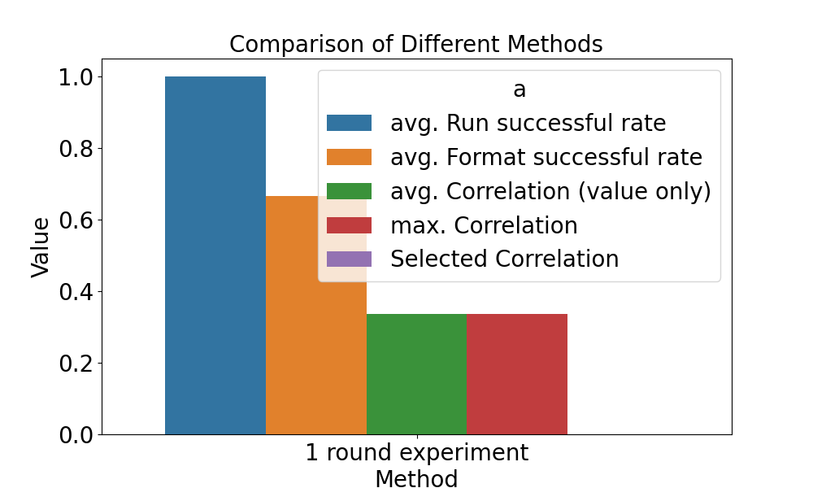

==============================
基准评测
==============================

简介
=============

研发能力的基准评测是本领域的重要研究问题。我们持续探索评测方法，当前基准如下。

开发能力基准评测
===================

基准评测用于在固定数据下评估因子效果，主要包括以下步骤：

1. :ref:`读取与准备评测数据 <data>`

2. :ref:`声明待测方法并传递参数 <config>`

3. :ref:`声明评测方法并传递参数 <config>`

4. :ref:`运行评测 <run>`

5. :ref:`保存与展示结果 <show>`

配置
-------------
.. _config:

.. autopydantic_settings:: rdagent.components.benchmark.conf.BenchmarkSettings

示例
+++++++
.. _example:

``bench_test_round`` 默认值为 10，约需 2 小时运行。若需将其从 ``10`` 改为 ``2``，可在 .env 文件中设置如下：

.. code-block:: Properties

      BENCHMARK_BENCH_TEST_ROUND=2

数据格式
-------------
.. _data:

``bench_data_path`` 下的样例数据为字典，每个 key 为因子名，value 为包含以下信息的因子数据：

- **description**：因子描述文本。
- **formulation**：模型公式（LaTeX）。
- **variables**：涉及变量的字典。
- **Category**：因子类别。
- **Difficulty**：实现或理解难度。
- **gt_code**：因子相关代码。

示例数据格式：

.. literalinclude:: ../../rdagent/components/benchmark/example.json
   :language: json

数据需放在 ``FACTOR_COSTEER_SETTINGS.data_folder_debug``，文件格式为 .h5 或 .md，且不能存于子文件夹。LLM-Agent 会审查文件内容并实现任务。

.. TODO: 增加自动生成数据脚本，见 `rdagent/app/quant_factor_benchmark/data`。

运行基准评测
-------------
.. _run:

完成 :doc:`../installation_and_configuration` 后可启动基准评测。

.. code-block:: Properties

      dotenv run -- python rdagent/app/benchmark/factor/eval.py

运行结束后会生成 pkl 文件，路径会在控制台最后一行输出。

结果展示
-------------
.. _show:

``analysis.py`` 脚本读取 pkl 文件并生成图片。可在 ``rdagent/app/quant_factor_benchmark/analysis.py`` 中指定 pkl 路径和 png 输出路径。

.. code-block:: Properties

      dotenv run -- python rdagent/app/benchmark/factor/analysis.py <log/path to.pkl>

图片将保存在指定路径。

相关论文
-------------

- `Towards Data-Centric Automatic R&D <https://arxiv.org/abs/2404.11276>`_：
  我们提出了 RD2Bench 基准，评测数据与模型研发能力。该基准包含一系列任务，考察 LLM-Agent 的实现能力。

.. code-block:: bibtex

    @misc{chen2024datacentric,
        title={Towards Data-Centric Automatic R&D},
        author={Haotian Chen and Xinjie Shen and Zeqi Ye and Wenjun Feng and Haoxue Wang and Xiao Yang and Xu Yang and Weiqing Liu and Jiang Bian},
        year={2024},
        eprint={2404.11276},
        archivePrefix={arXiv},
        primaryClass={cs.AI}
    }

.. image:: https://github.com/user-attachments/assets/494f55d3-de9e-4e73-ba3d-a787e8f9e841

如需复现论文中的基准，请参考：`RD2bench.json <../_static/RD2bench.json>`_。
评测时请设置 ``only_correct_format=False``。

